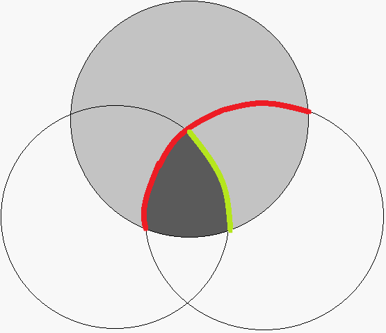

| #未完成-正文 | #未完成-习题 | #UNFIXED | 
| ------------ | ------------ | ------- |

# sigma代数和抽象测度

> 本节虽然有较多的定义, 但是并不繁重, 只要掌握最重要的Caratheodory条件即可. 
>
> 在之后的章节中将会讨论更多测度相关的对象, 例如积测度, 概率论中独立性的构造等等, 这些是比较困难的部分. 

## 半代数

\<文字定义\>

半代数是指对交封闭, 而对差集满足一定性质的代数结构. 

\<形式定义\>

$$
\semialg({\cal S}):=
\Field{(\and)}{\;\;}{
    & {\cal S}\text{<set>}\\
    \\
    & \bigcup\limits_{A\in \cal S} A, \varnothing \in {\cal S}\\
    \\
    & \Field{
        \forall A, B\in {\cal S}: (\and)
    }{\;\;}{
        & A \cap B \in {\cal S}\\
        & \exist {\cal X}\sube {\cal S}: \partition(B \diagdown A, {\cal X})
    }\\
}
$$

## 集代数

\<文字定义\>

集代数是指对并和对全集取补封闭的集族. 

\<形式定义\>

$$
\setalg({\cal S}):=
\Field{(\and)}{\;\;}{
    & {\cal S}\text{<set>}\\
    & \bigcup\limits_{A\in \cal S} A, \varnothing \in {\cal S}\\
    & \forall A, B\in {\cal S}: B \diagdown A, A \cup B \in {\cal S}
}
$$

\<RMK\>

关于交, 并运算, 实际上集合代数成环, 因此也有些文本当中叫做Boolean环. 

下面我们来进行验证. 

集合代数关于运算 $\cup$ 成一交换群. 

1. 以 $\varnothing$ 为零元
2. 满足交换律和结合律
3. $A$ 的逆取作 $\bigcup\limits_{A\in \cal S} A \diagdown A$

而交运算成一幺半群. 

1. 以 $\Omega$ 为幺元
2. 满足结合律

众所周知地, 集合的交, 并运算满足分配律, 至此验证了集合代数成环. 

## $\sigma$代数

\<文字定义\>

$\sigma$代数则是指对可列并和对全集取补运算封闭的集族. 

\<形式定义\>

$$
\sigmaalg({\cal S}):=
\Field{(\and)}{\;\;}{
    & {\cal S}\text{<set>}\\
    & \bigcup\limits_{A\in \cal S} A, \varnothing \in {\cal S}\\
    & \forall A, B\in {\cal S}: B \diagdown A \in {\cal S}\\
    & \forall {\cal A} \sube {\cal S}: 
        \Bigg(\card {\cal A} \prec \aleph(\varnothing)\Bigg)
        \Rarrow
        \Bigg(\bigcup_{A \in {\cal A}} \in {\cal S}\Bigg)
        \\
}
$$

## $\sigma$代数的等价条件

\<形式描述\>

$$
\FieldEndl{
    & \forall \setalg({\cal S}):(\LRarrow)
}{\;\;}{
    & \sigmaalg({\cal S})\\\\
    & \FieldEndl{
        & \forall E:\{n \prec \aleph(\varnothing)\}\to {\cal S}:
    }{\;\;}{
        & \CondBegin\\
        & E(n) \sube E(n\ddagger)\\
        & \CondEnd\\
        & \bigcup_{n \prec \aleph(\varnothing)} E(n) \in {\cal S}
    }\\\\
    & \FieldEndl{
        & \forall E:\{n \prec \aleph(\varnothing)\}\to {\cal S}:
    }{\;\;}{
        & \CondBegin\\
        & E(n) \supe E(n\ddagger)\\
        & \CondEnd\\
        & \bigcap_{n \prec \aleph(\varnothing)} E(n) \in {\cal S}
    }
}
$$

\<文字证明\>

从 ${\cal S}$ 是 $\sigma$ 代数推出两个等价条件的证明从略(在形式证明中也省略), 因为 $\sigma$ 代数本来就可列并和可列交, 更不要说单调列了. 

从 ${\cal S}$ 是集代数加上第一个条件, 我们很容易知道有限多个集合的并必处于集代数中, 而由选择公理, 我们可以构造一个由并集形成的单调列, 从而得到 ${\cal S}$ 是 $\sigma$ 代数. 

从 ${\cal S}$ 是集代数加上第二个条件, 我们需要稍微绕一下, 我们先观察有限个集合的补的交形成的单调减列(同样需要依赖选择公理), 它满足第二个条件, 从而我们得到这些集合的并处于 ${\cal S}$ 中, 而由 ${\cal S}$ 是个代数, 取补封闭, 因此再取一次补集, 获得的就是这个集合列的并了. 

\<形式证明\>

$$
\FieldEndl{
    & \forall \setalg({\cal S}):
}{\;\;}{
    & \CondBegin\\
    & \FieldEndl{
        & \forall E:\{n \prec \aleph(\varnothing)\}\to {\cal S}:
    }{\;\;}{
        & \CondBegin\\
        & E(n) \sube E(n\ddagger)\\
        & \CondEnd\\
        & \bigcup_{n \prec \aleph(\varnothing)} E(n) \in {\cal S}
    }\\
    & \CondEnd\\
    & \FieldEndl{
        & \forall E:\{n \prec \aleph(\varnothing)\}\to {\cal S}:
    }{\;\;}{
        & F :: \Field{(\and)}{\;\;}{
            & F: \{n \prec \aleph(\varnothing)\}\to {\cal S}\\
            & F(n) = \bigcup_{m \preceq n} E(m)
        }\\
        & \bigcup_{n \prec \aleph(\varnothing)} E(n)
        = \bigcup_{n \prec \aleph(\varnothing)} F(n) 
        \in {\cal S}
    }\\
}
$$

\<形式证明\>

$$
\FieldEndl{
    & \forall \setalg({\cal S}):
}{\;\;}{
    & \CondBegin\\
    & \FieldEndl{
        & \forall E:\{n \prec \aleph(\varnothing)\}\to {\cal S}:
    }{\;\;}{
        & \CondBegin\\
        & E(n) \sube E(n\ddagger)\\
        & \CondEnd\\
        & \bigcup_{n \prec \aleph(\varnothing)} E(n) \in {\cal S}
    }\\
    & \CondEnd\\
    \\
    & \Omega := \bigcup_{E \in {\cal S}} E\\
    & \complement(E) := \Omega \diagdown E\\
    \\
    & \FieldEndl{
        & \forall E:\{n \prec \aleph(\varnothing)\}\to {\cal S}:
    }{\;\;}{
        & F :: \Field{(\and)}{\;\;}{
            & F: \{n \prec \aleph(\varnothing)\}\to {\cal S}\\
            & F(n) = \bigcap_{m \preceq n} \complement(E(m))
        }\\
        & \bigcup_{n \prec \aleph(\varnothing)} E(n)
        = \complement(\bigcup_{n \prec \aleph(\varnothing)} \complement(F(n)))
        \in {\cal S}
    }\\
}
$$

## $\sigma$扩张的定义

\<文字定义\>

一个集合的 $\sigma$ 扩张是指包含这个集合的最小 $\sigma$ 代数. 

\<形式定义\>

$$
\begin{matrix}
\sigma({\cal A})::
\Field{(\and)}{\;\;}{
    & \Omega := \bigcup_{A \in {\cal A}} A\\
    & {\cal SS} := \left\{{\cal S}: 
    \Field{(\and)}{\;\;}{
        & {\cal A} \sube {\cal S} \sube \Pow(\Omega)\\
        & \sigmaalg({\cal S})\\
    }\right\}\\
    & \sigma({\cal A}) = \bigcap_{{\cal S}\in {\cal SS}} {\cal S}
}\\
\left.\begin{aligned}
    & ::: {\cal A}\text{<set>}\\
    & ::: \forall E\in {\cal A}:E\text{<set>}\\
\end{aligned}\right.
\end{matrix}
$$

## Borel 代数

Borel 代数是指对拓扑的 $\sigma$ 扩张. 

$$
{\frak B}(X,\tau):=\sigma(\tau):::\text{top-space}(X,\tau)
$$

## 外测度的定义

\<文字定义\>

外测度(exterior msr)是指具有下可加性的集函数. 

\<形式定义\>

$$
\begin{matrix}
\exmsr(\mu):=
\Field{(\and)}{\;\;}{
    & \exist {\cal S}: \mu: {\cal S} \to [[0, \infin]]\\
    \\
    & {\cal S} :: \mu: {\cal S} \to [[0, \infin]]\\
    \\
    & \sigmaalg({\cal S})\\
    \\
    & \FieldEndl{
        & \forall {\cal A} \sube {\cal S}: 
    }{\;\;}{
        & \CondBegin\\
        & \card {\cal S} \prec \aleph(\varnothing)\\
        & \CondEnd\\
        & \mu \,\left(\bigcup_{A\in {\cal A}} A\right) 
            \le \sum_{A \in {\cal A}} \mu(A)
    }
}
\end{matrix}
$$

## 测度的定义

\<形式定义\>

$$
\begin{matrix}
\msr(\mu):=
\Field{(\and)}{\;\;}{
    & \exist {\cal S}: \mu: {\cal S} \to [[0, \infin]]\\
    \\
    & {\cal S} :: \mu: {\cal S} \to [[0, \infin]]\\
    \\
    & \sigmaalg({\cal S})\\
    \\
    & \FieldEndl{
        & \forall {\cal A} \sube {\cal S}: 
    }{\;\;}{
        & \CondBegin\\
        & \card {\cal S} \prec \aleph(\varnothing)\\
        & \forall A, B\in {\cal A}: 
        \Field{(\or)}{\;\;}{
            & A \cap B = \varnothing\\ 
            & A = B
        }\\
        & \CondEnd\\
        & \mu \,\left(\bigcup_{A\in {\cal A}} A\right) 
            = \sum_{A \in {\cal A}} \mu(A) 
    }
}
\end{matrix}
$$

## 测度的等价条件

\<文字描述\>

如果一个外测度满足单调列收敛而且对有限个集合的无交并满足可加性, 则它一定是测度. 

\<形式描述\>

#TODO

\<形式证明\>

## 测度空间的定义

\<文字定义\>

一个集合与其上的$\sigma$代数和测度合称测度空间: 

\<形式定义\>

$$
\msrspace(X):=
\Field{(\and)}{\;\;}{
    & \sigmaalg(X[{\frak M}])\\
    \\
    & X[\mu]: X[{\frak M}] \to [[0, \infin]]\\
    & \msr(X[\mu])\\
    \\
    & X[\S] \in X[{\frak M}]\\
    & X[\S] = \bigcup_{A \in X[{\frak M}]} A\\
}
$$

\<RMK\>

这个集合 $X[\S]$ 被称为这个测度空间的基底, 基底集合中的元素称为测度空间中的点. 

可测集是指以这个集合为全集的$\sigma$代数, 测度的定义域是这个集合. 

## 测度对应的空间

\<形式定义\>

$$
\begin{matrix}
\text{MsrSpace}(\mu) :: \Field{(\and)}{\;\;}{
    & M := \text{MsrSpace}(\mu)\\
    & M[\mu] = \mu\\
    & M[{\frak M}] = \dom \mu\\
    & M[\S] = \bigcup_{S\in \dom \mu} S\\
}\\
::: \msr(\mu)
\end{matrix}
$$

## Caratheodory 条件的定义

\<文字定义\>

Caratheodory 条件, 是指由一个集合产生的二分划使得给定外测度满足二元的可加性. 

\<形式定义\>

$$
\begin{matrix}
\text{carath}(X,\mu)(E)
:= \Field{(\and)}{\;\;}{
    & E\in \Pow(X) \\
    & \mu(A\cap E)+\mu(A \diagdown E) = \mu(A)
}\\
\left.\begin{aligned}
    & :::X\text{<set>}\and \exmsr(\mu)\\
    & :::\mu: \Pow(X) \to [[0,\infin]]\\
\end{aligned}\right.
\end{matrix}
$$

\<RMK\>

注意是用给定的集合分划其他集合, 而不是反过来. 

## Caratheodory 定理

\<文字描述\>

满足 Caratheodory 条件的集族构成$\sigma$代数. 不仅如此, 如果把外测度限制到这一集族上, 我们将得到一个测度. 

\<形式描述\>

$$
\FieldEndl{
    & \forall X\text{<set>}\\
    & \forall \mu:\Pow(X)\to [[0,\infin]]
}{\;\;}{
    & \CondBegin\\
    & \exmsr(\mu)\\
    & \CondEnd\\
    & {\cal M} := \bigg\{E : \text{carath}(X, \mu)(E)\bigg\}\\
    & \sigmaalg({\cal M}) \and \msr\left(\mu\big|_{\cal M}\right)
}
$$

\<文字证明\>

这里采取一种步骤式的证明方法, 我们先证明上述的 ${\cal M}$ 是一个集代数, 再说明 $\mu$ 在无交可列并情况下的运算性质, 于此同时证出 ${\cal M}$ 是 $\sigma$ 代数. 

第一部分当中, 我们不需要任何的分析技巧, 只需要一些对集合的直观理解和一些符号操作的技巧. 

1. 显然地, 全集 $X$ 和空集 $\varnothing$ 都是 ${\cal M}$ 中的元素. 

2. 而后我们发现对全集取补 $X \diagdown E$ 是对合的(即 $X\diagdown (X\diagdown E) = E$)

3. 再由恒等式 $\mu(T) = \mu(E \cap T) + \mu(E^\complement \cap T)$
    - 对任一给定的 $A$, 我们可以先将 $A$ 当作 $T$, 用 $E$ 分划 $A$, 再将剩余部分中的 $E \cap A$ 用 $F$ 分划一次. 
    - 这样, 我们的任务变成证明 $\mu(E \cap F^\complement \cap A) + \mu(E^\complement \cap A)=\mu((E \cap F)^\complement \cap A)$
    - 观察到 $E \cap F^\complement \cap A = E \cap ((E \cap F)^\complement \cap A)$ 和 $E^\complement \cap A = E^\complement \cap ((E \cap F)^\complement \cap A)$
    - 这就是说, 将 $(E \cap F)^\complement \cap A$ 当作 $T$ 并用 $E^\complement$ 分划它, 即得证. 

第二部分当中, 我们由有限情形推到可数情形, 因此需要一些分析中的技巧来帮助我们. 

讨论 $E:[1 .. ]\to {\cal M}$ 的可列并, 另外保证 $E(n) \cap E(m) = \varnothing \or n = m$
1. 设 $G(N) = \bigcup\limits_{n \in [1 .. N]}E(n)$, 特别地, $G(\infin) = \bigcup\limits_{n \in [1 .. ]}E(n)$
2. 我们希望证明 $\mu(A\cap G(\infin)) + \mu(A \diagdown G(\infin)) =\mu(A)$
3. 而 $\mu(A \cap G(N)) \le \mu(A\cap G(\infin))$, 并且 $N\to \infin$ 时, 有如下结论
    - 对任一正整数 $N$ 有 $\mu(G(N) \cap A) = \sum\limits_{n\in [1 .. N]} \mu(E(n) \cap A)$ (用各个 $E(n)$ 分划 $E(n) \cap A$ 的并集)
    - 当 $N \to \infin$ 时, 有结论 $\lim\limits_{N \to \infin}\mu(G(N) \cap A) =\sum\limits_{n\in [1 ..]} \mu(E(n) \cap A)$
    - 我们给出了 $\mu(G(\infin) \cap A)$ 的上界和下界. 
4. 结合外测度的性质, 即得到了 $\mu(A) \le \mu(A \cap G(\infin)) + \mu(A \diagdown G(\infin)) \le \mu(A)$ 

\<形式证明:第一部分\>

$$
\FieldEndl{
    & \forall X\text{<set>}\\
    & \forall \mu:\Pow(X)\to [[0,\infin]]
}{\;\;}{
    & \CondBegin\\
    & \exmsr(\mu)\\
    & \CondEnd\\
    & {\cal M} := \bigg\{E : \text{carath}(X, \mu)(E)\bigg\}\\
    & \varnothing, X \in {\cal M} \\
    \\
    & E^\complement := X \diagdown E :: E \in \Pow(X)\\
    \\
    & \FieldEndl{
        & \forall E\in {\cal M}: \forall A\in \Pow(X): 
    }{\;\;}{
        & \mu(E) = \mu(A \cap E^\complement) +  \mu(A \cap E) \\
        & = \mu(A \cap (E^\complement)^\complement) + \mu(A \cap E^\complement)\\
    }\\
    \\
    & \forall E\in {\cal M}: E^\complement\in {\cal M}\\
    \\
    & \FieldEndl{
        & \forall E, F\in {\cal M}:\forall A\in \Pow(X): 
    }{\;\;}{
        & \CondEnd\\
        & \mu(A) = \mu(E \cap A) + \mu(E^\complement \cap A)\\
        & = \mu(E \cap F \cap A) + \mu(E \cap F^\complement \cap A) + \mu(E^\complement \cap A)\\
        \\
        & \mu(E \cap F^\complement \cap A) + \mu(E^\complement \cap A)\\
        & = \mu(E \cap ((E \cap F)^\complement \cap A)) + 
            \mu(E^\complement \cap ((E \cap F)^\complement \cap A))\\ 
        & = \mu((E \cap F)^\complement \cap A)\\
        \\
        & \mu(A) = \mu(E \cap F \cap A) + \mu((E \cap F)^\complement \cap A)\\
    }\\
    \\
    & \forall E, F\in {\cal M}: E\cap F\in {\cal M}\\
    \\
    & \setalg({\cal M})\\
}
$$

\<形式证明:第二部分\>

$$
\FieldEndl{
    & \forall X\text{<set>}\\
    & \forall \mu:\Pow(X)\to [[0,\infin]]
}{\;\;}{
    & \CondBegin\\
    & \exmsr(\mu)\\
    & \CondEnd\\
    & {\cal M} := \bigg\{E : \text{carath}(X, \mu)(E)\bigg\}\\
    & E^\complement := X \diagdown E :: E \in \Pow(X)\\
    \\
    & \setalg({\cal M})\\
    \\
    & \FieldEndl{
        & \forall E: [1 .. ] \to {\cal M}:
    }{\;\;}{
        & \CondBegin\\
        &  n = m \or E_{(n)} \cap E_{(m)} = \varnothing\\
        & \CondEnd\\
        & G(N) := \bigcup_{n \in [1 .. N]} E_{(n)}\\
        & G(\infin) := \bigcup_{n \in [1 ..]} E_{(n)}\\\\
        & \FieldEndl{
            & \forall A \sube X: 
        }{\;\;}{
            & \CondEnd\\
            & \forall N \in [1 ..]:
                \mu(A \cap G_{(N+1)})
                = \mu(A \cap G_{(N)}) + \mu(A \cap E_{(N+1)})\\
            & \forall N \in [1 ..]:
                \mu(A \cap G_{(N)}) = \sum_{n\in [1 .. N]}\mu(A \cap E_{(n)})\\
            & \lim_{N \to \infin} \mu(A \cap G_{(N)}) 
            = \sum_{n\in [1 .. ]}\mu(A \cap E_{(n)})
            \ge \mu(A \cap G_{(\infin)})
        }\\\\
        & \FieldEndl{
            & \forall A \sube X:
        }{\;\;}{
            & \CondEnd\\
            & \mu(A) 
            \ge \lim_{N \to \infin} \mu(A \cap G_{(N)}) + \mu(A \diagdown G_{(\infin)})\\
            & = \sum_{n\in [1 .. ]} \mu(A \cap E_{(n)}) + \mu(A \diagdown G_{(\infin)})\\
            & \ge \mu(A \cap G_{(\infin)}) + \mu(A \diagdown G_{(\infin)})\ge \mu(A)
        }\\\\
        & \sum_{n\in [1 ..]}\mu(E_{(n)}) 
        = \sum_{n \in [1 .. ]}\mu(G_{(\infin)} \cap E_{(n)}) 
        = \mu(G_{(\infin)})\\
        & G_{(\infin)} \in {\cal M}\\
    }\\\\
    & \forall E: [1 .. ] \to {\cal M}: 
    \bigcup_{n\in [1 ..]} E_{(n)} 
    = \bigcup_{n \in [1 ..]} (E_{(n+1)} \diagdown E_{(n)}) \cap E_{(1)}
    \in {\cal M}\\
    & \sigmaalg({\cal M}) \and \msr\left(\mu\big|_{\cal M}\right)\\
}
$$

\<RMK\> 

Caratheodory条件给我们提供了一个构造可测集的充分条件, 即只要一个 $\sigma$ 代数能够被 $\text{Carath}(X,\mu)$ 包含, 那么它一定能使得 $\mu$ 成为测度. 

下图是证明 ${\cal M}$ 对交封闭的技巧的Venn图: 

- 最上面的圆圈是$A$, 沿逆时针方向三个圆圈依次表示 $A$, $E$, $F$
- 红线表示用 $E$ 将 $A$ 切成两半, 绿线表示用 $F$ 将 $A\cap E$ 切成两半. 
- 深灰色部分是 $A\cap E\cap F$, 浅灰色部分是 $A\cap (E\cap F)^\complement$ . 

***

# 习题
